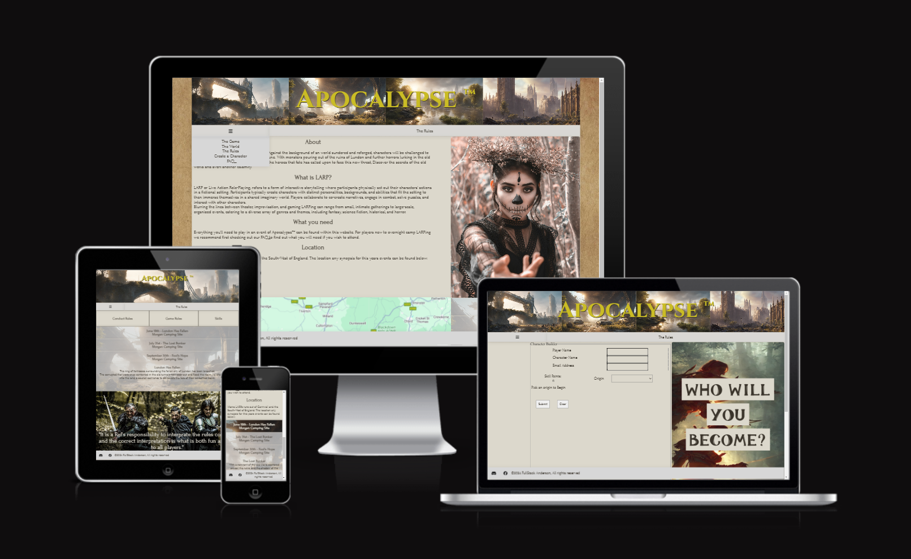
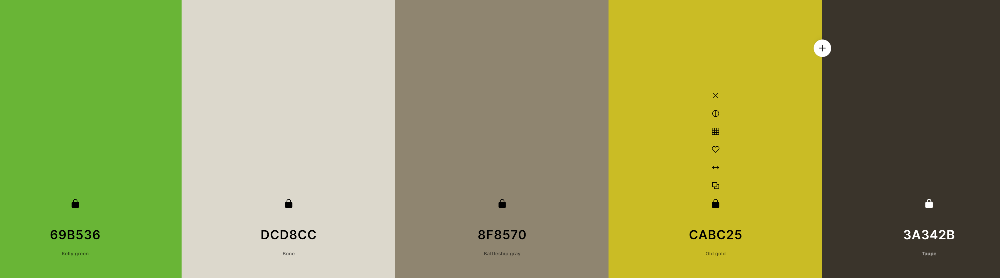

# ApocalypseTM

ApocalypseTM acts as a advert and a point of refrence for a upcoming UK based Live Action Roleplay with the same name, it contains the rules for how the game is goverened, the setting brief that the players need to know and funtionality to build a character for the game. As a new system designed by hobbiests, the rules and information may need to be updated regulaly. So utilizing Javascript a rule only needs to be updated in one location for it to be updated throughout the entire site.

https://laurieanderson92.github.io/ApocalypseTM/

---

## CONTENTS

* [User Experience](#user-experience-ux)
  * [User Stories](#user-stories)

* [Design](#design)
  * [Colour Scheme](#colour-scheme)
  * [Typography](#typography)
  * [Imagery](#imagery)
  * [Wireframes](#wireframes)

* [Features](#features)
  * [General Features on Each Page](#general-features-on-each-page)
  * [Future Implementations](#future-implementations)
  * [Accessibility](#accessibility)

* [Technologies Used](#technologies-used)
  * [Languages Used](#languages-used)
  * [Frameworks, Libraries & Programs Used](#frameworks-libraries--programs-used)

* [Deployment & Local Development](#deployment--local-development)
  * [Deployment](#deployment)
  * [Local Development](#local-development)
    * [How to Fork](#how-to-fork)
    * [How to Clone](#how-to-clone)

* [Testing](#testing)

* [Credits](#credits)
  * [Code Used](#code-used)
  * [Content](#content)
  * [Media](#media)
  * [Acknowledgments](#acknowledgments)

---

## User Experience (UX)

### Initial Discussion

ApocalypseTM is a upcoming Live Action Role-Play based in the South West of England, Most of the space used is in Discord and Facebook which doesn't gell well with a interactive and tone setting experience. The Organizers of the game are spending a large amount of time manualy awnsering questions and repeating awnsers. This site aims to consense the relevant information and is designed to be easily updatable as the game continues.

### Key information for the site

- The rules of the game, easily accessible on a mobile device while in play.
- A way to create a character without the need for mental maths
- Repositry of infoation about the game, setting and world.
- Synposis of coming games along with the location of the games that year.
- Links to the game social pages where new players can be interactive.

### User Stories

#### New LARPers
Users who haven't larped before, or have little experience Larping
- A first timer who is new to LARP should be able to find out what LARP is
- A first timer who is looking to attend their first LARP should find a clear list of what is expected of them
- Their experience of the website should be enhanced with intuitive navigation 

#### Players 
Users who have signed up to the game and are looking for rules or event information
- A player should be able to see, at a glance when the next event is and what the synopsis for the event is
- A player should be able to easily navigate the rules for how the game works
- Their experience should be thematic with a good user experience.

#### Game Masters 
Users who may use the website to help them run the game.
- A ref should be able to refer to rules quickly and have all of the information they need to make a ruling
- A ref should have easy access to the conduct rules incase players are in breach of them.
- Their experience should be focused on getting information that they need quickly, likely on a mobile screen.

## Design

ApocalypseTM was designed with a sleek and minimalist aesthetic, emphasizing functionality and ease of navigation for users. 
The layout is clean and well-organized, featuring a simple yet effective color scheme that combines muted tones with pops of 
vibrant colors to draw attention to key elements. The use of sans-serif fonts enhances readability and contributes to the 
modern and polished look of the site.

### Colour Scheme

The website uses a pallate of colours that invoke a fantasy map, inspired by Lord of the Rings and other grand landscapes that also mirrors areas of outstanding beauty found in the south west of England

### Typography

Google fonts were used for this project:

Forum was used for the paragraph elements. It is a serif font.
Cinzel was used for headings. It is a serif font

Both fonts were used to invoke a fantasy feel to the page

### Imagery

The main imagry in this site is going to be London after a extintion event. The devestation levels are low, but nature will be reclaiming the world. the site will follow these warm dirt colors with effects to make images look weathered.
The pictures were open sourced from [Pexels](https://www.pexels.com/) or generated by [DeepAI](https://deepai.org/machine-learning-model/text2img)

Edits to the images were made using [Pixlr](https://pixlr.com/express/)

### Wireframes

[index.html](assets/documentation/index.html.png)

[faq.html](assets/documentation/faq.html.png)

[rules.html](assets/documentation/rules.html.png)

[world.html](assets/documentation/world.html.png)

[charatcer.html](assets/documentation/character.html.png)

## Features

The website is comprised of seven pages, five of which are accessible from the navigation menu (index, rules, faq, character & world.) The other pages are a confirmatiopn page which is shown once a user submits the form on the character page and a 404 page.

### General features on each page

All of the website pages have:

- A responsive [navigation bar](assets/documentation/features-navbar.png) at the top which allows the user to navigate around the website. above the bar is a banner image that scales based on with and can expand into 4 images that depict the scene and tone of the game. The dropdown bar is behind the burger icon and is animated to be interactable and the rules button is front and center for easy reference, particularly on mobile devices.
- A [footer](assets/documentation/features-footer.png) that conatins the copywright information along with the socials of the webpage.
- [Responsive design](assets/documentation/features-responsive-design.png) that prevents the content from getting too wide on large and high resolution monitors above 1440px width.
- A display of the [events](assets/documentation/features-events.png) that are running this year along wit their synopsis.

The Home Page.
- A API callout to google maps to that then display the evnts location for a year
- A about us section dedicated to welcoming new players and explaing LARPING as a hobby as well as an introduction to Apocolypse now

The Rules Page
- A [secondary Nav display](assets/documentation/features-secondrynav.png), to navigate around the different rule types Conduct rules/Game Rules and Skill Rules to keep the page length down and to hone in on relevant information when using a limited screen size.
- Three sections that are initially hidden, but are revealed when the div in the Nav section described above is clicked.
- A page that auto populates from the object array of skills, so that chnages to the skills in the JS appear throughout the website.

The FAQ page.
- A section that displays frequently asked questions and their awnsers.
- A API callout to google maps to that then display the evnts location for a year

The World Page
-  A section that goes into detail about the setting of the world

The Character Page
- A [form for creating a character](assets/documentation/features-charactercreator.png) in the setting.

### Future Implementations

- A Mechanisum for storing characters.
- A way to upgrade skills for existing characters
- Wrap for in loops in if statements to filter unwanted properties

### Accessibility

I have tried to code defensively and ensuring that the website is as accessible friendly as possible. I have achieved this by:

- Using semantic HTML.
- Using descriptive alt attributes on images on the site.
- Providing information for screen readers where there are icons used and no text - such as the Social media links via aria labels.
- Ensuring that there is a sufficient colour contrast throughout the site.

The code has been validated using lighthouse, w3c and Jugsaw, the reults are below:

[Lighthouse Testing](assets/documentation/apoctm-lighthouse.png)

[Jigsaw-Testing](assets/documentation/apoctm-cssvalidation-jigsaw.png)

[W3 Testing](assets/documentation/apoctm-htmlvalidation-w3c.png)

## Technologies Used

### Languages Used

- HTML5
- CSS
- JavaScript

### Frameworks, Libraries & Programs Used

Add any frameworks, libraries or programs used while creating your project.

Make sure to include things like git, GitHub, the program used to make your wireframes, any programs used to compress your images, did you use a CSS framework like Bootstrap? If so add it here (add the version used).

A great tip for this section is to include them as you use them, that way you won't forget what you ended up using when you get to the end of your project.

- Git - used to controle versions
- Github Aced as the reposirty for the projectr
- Balsamiq - Used to create wireframes.
- Googlemaps API - Callout for the map
- Google Fonts - To import the fonts used on the website.
- Font Awesome - For the iconography on the website.
- Google Dev Tools - To troubleshoot and test features, solve issues with responsiveness and styling.
- [Favicon.io](https://favicon.io/) - To create favicon.
- [Am I Responsive?](https://ui.dev/amiresponsive) - To show the website image on a range of devices.

## Deployment & Local Development

### Deployment

<ol>
  <li>Log in (or sign up) to Github.</li>
  <li>Find the repository for this project, [ApocalypseTM](https://github.com/LaurieAnderson92/ApocalypseTM)</li>
  <li>Click on the Settings link.</li>
  <li>Click on the Pages link in the left hand side navigation bar.</li>
  <li>In the Source section, choose main from the drop down select branch menu. Select Root from the drop down select folder menu.</li>
  <li>Click Save. Your live Github Pages site is now deployed at the URL shown.</li>
</ol>

### Local Development

The local development section gives instructions on how someone else could make a copy of your project to play with on their local machine. This section will get more complex in the later projects, and can be a great reference to yourself if you forget how to do this.

#### How to Fork

To fork the ApocalyseTM repository:
<ol>
  <li>Log in (or sign up) to Github.</li>
  <li>Go to the repository for this project: https://github.com/LaurieAnderson92/ApocalypseTM</li>
  <li>Click the Fork button in the top right corner.</li>
</ol>

#### How to Clone

<ol>
  <li>Log in (or sign up) to GitHub.</li>
  <li>Go to the repository for this project: https://github.com/LaurieAnderson92/ApocalypseTM</li>
  <li>Click on the code button, select whether you would like to clone with HTTPS, SSH or GitHub CLI and copy the link shown.</li>
  <li>Open the terminal in your code editor and change the current working directory to the location you want to use for the cloned directory.</li>
  <li>Type 'git clone' into the terminal and then paste the link you copied in step 3. Press enter.</li>
</ol>

## Testing & Validation

### Testing

Testing was ongoing throughout the project. I utilised Chrome developer tools while building the site to troubleshoot any issues as I went along.

The following issues were raised during my end project meeting with my mentor:
<ul>
<li>The site didn't have very clear margins. Margins have been added to bring it in alignment so that tect is easy to read.</li>
<li>There was a few errors firing when certain pages loaded, scripts that Ran when the DOM loaded were running on every page. Script split into four .js files to prevent those errors.</li>
<li>There wasn't enough comments explaining code layout and funtionality, this has now been added.</li>
</ul>

### Validation

The results of the validatior jshint. 

It stated some undefined variables, but they are refrenced in the other .js files

There are two warnings:
- "The body of a for in should be wrapped in an if statement to filter unwanted properties from the prototype." - This has been added to future enhancements.
- "Functions declared within loops referencing an outer scoped variable may lead to confusing semantics." - A comment has been added in to explain this as part of the function

[JShint Character](assets/documentation/jshint-character.png)
[JShint Events](assets/documentation/jshint-events.png)
[JShint Script](assets/documentation/jshint-script.png)
[JShint Skills](assets/documentation/jshint-skills.png)

## Credits

### Code Used

[Google Maps API tutorial](https://developers.google.com/maps/documentation/javascript?_gl=1*1rqigl6*_up*MQ..*_ga*MjQ0MDU2MzA2LjE3MTI0MzEzODc.*_ga_NRWSTWS78N*MTcxMjQzMTM4Ny4xLjAuMTcxMjQzMTM4Ny4wLjAuMA..)

### Content

The content was provided by myself and a friend called Richard Morgan, who is one of the top refs for ApocaplyseTM

###  Media

AI generated art from: [Deep Ai](https://deepai.org/)
  
###  Acknowledgments

Thank you to [Kera Cudmore](https://github.com/kera-cudmore) for her help with a readme format and supplying this template
Thank you to my Mentor Rory Patrick fior asising me throught the project
